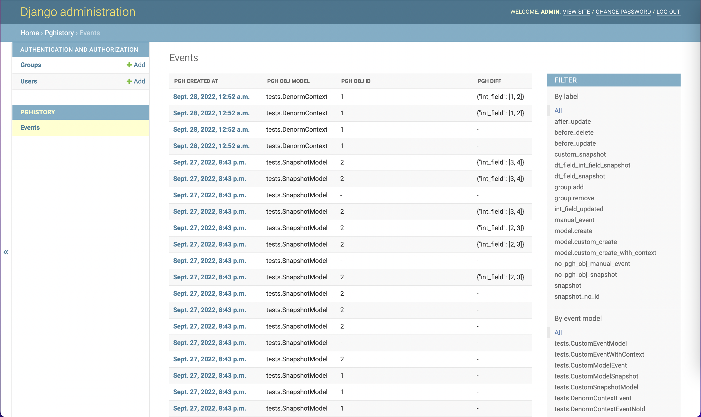
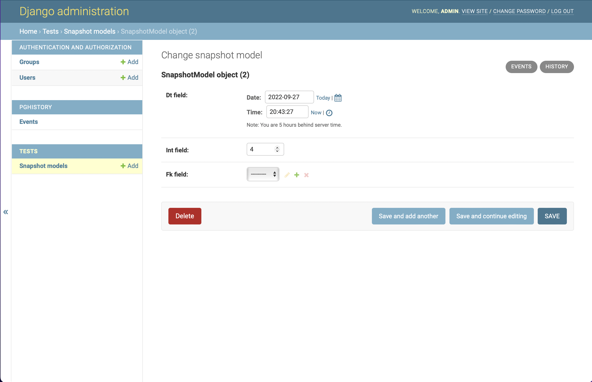
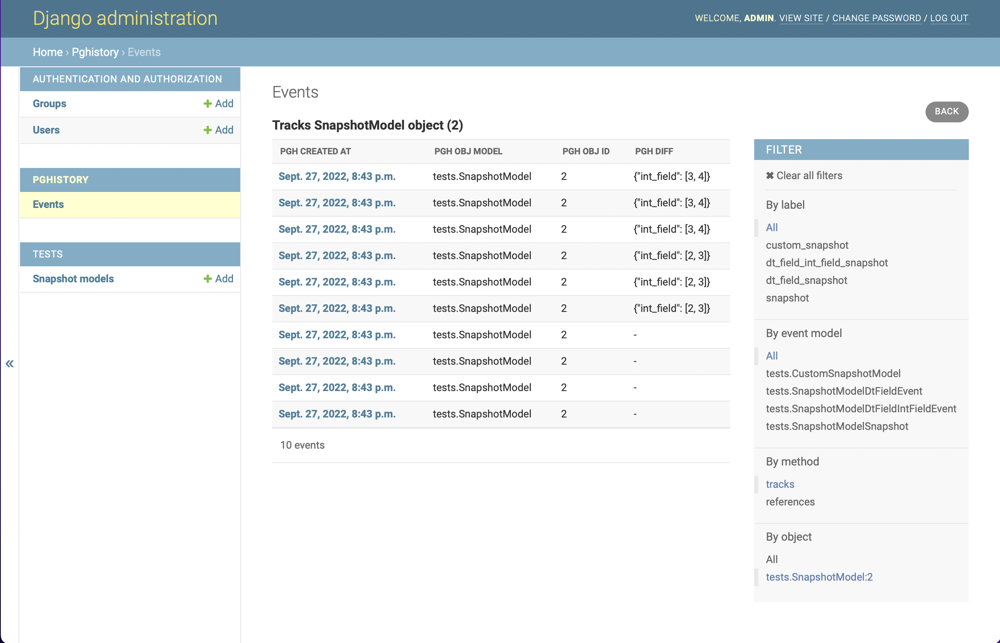

# Admin Integration

`django-pghistory` comes with an optional integration into the [Django admin](https://docs.djangoproject.com/en/4.1/ref/contrib/admin/). Here we cover the basics of how it works and the different configuration options.

## Installation

Activate the admin integration by adding `pghistory.admin` to `settings.INSTALLED_APPS`.

!!! important

    Be sure to add `pghistory.admin` *above* the `django.contrib.admin`, otherwise the custom admin templates won't be used.

## The Events Admin

By default, the admin integration will register an admin page for the [pghistory.models.Events][] proxy model under the "pghistory" section. For example:



Although this admin page is viewable and filterable, it's primarily used by other admin pages to show events. As we'll show later, other admin pages automatically show a link to this page when tracked.

If you are unfamiliar with the aggregate event proxy model, see the [Aggregating Events and Diffs](aggregating_events.md) section. By default, the admin page for this model shows the `pgh_created_at`, `pgh_obj_model`, `pgh_obj_id`, and `pgh_diff` fields.

Here are all of the settings that allow you to configure the aggregate event admin view:

* **PGHISTORY_ADMIN_ORDERING**: Change how events are ordered. Defaults to `"-pgh_created_at"`.
* **PGHISTORY_ADMIN_MODEL**: Change the model. It must inherit [pghistory.models.Events][]. Defaults to `"pghistory.Events"`.
* **PGHISTORY_ADMIN_QUERYSET**: Change the default queryset. `settings.PGHISTORY_ADMIN_MODEL` is ignored when this setting is used.
* **PGHISTORY_ADMIN_CLASS**: Change the default admin class. Must subclass [pghistory.admin.EventsAdmin][]. Defaults to `"pghistory.admin.EventsAdmin"`.
* **PGHISTORY_ADMIN_ALL_EVENTS**: The default admin page shows all paginated events. This can be an expensive query for large amounts of events. Set this to `False` and only show events when a filter is selected or when shown from another admin page. This setting only works for Django 3.1 and above.

## Tracked Model Admin Pages

Models that are tracked by `django-pghistory` will automatically have two buttons rendered:

1. An "Events" button on the list page. Clicking on this will redirect the user to the events admin page pre-filtered by the tracked model.
2. An "Events" button on the object page. Clicking on this will redirect the user to the events admin page pre-filtered by the tracked object.

Below we show a flow starting from an object page of a test model.
The object page has a special "Events" button:



!!! note

    Remember, the "History" button shows the default Django admin history page.

Clicking on "Events" goes to the events admin page pre-filtered by the object:



Pre-filtered object pages have a few special properties that aren't on the default events admin:

1. The event filtering method can be toggled, allowing you to see events that directly track the object (using `Events.objects.tracks()`) or events that reference the object (using `Events.objects.references()`). See the `By method` filter on the right side of the screen shot.
2. A "Back" button in the top right corner will take you back to the object page.

## Event Model Admin Pages

Use the [pghistory.admin.EventModelAdmin][] admin class when making admin pages for event models. When this admin class is used, the tracked objects will render buttons to the event admin similar
to the functionality of the `Events` model shown in previous sections.

Take the following model and associated tracker:

```python
@pghistory.track(pghistory.Snapshot(), model_name="MyModelSnapshot")
class MyModel(models.Model):
    dt_field = models.DateTimeField()
    int_field = models.IntegerField()
```

Now let's register an admin for the tracked model and one for the snapshot model using [pghistory.admin.EventModelAdmin][]:

```python

from django.contrib import admin
from pghistory.admin import EventModelAdmin
import tests.models as test_models

class MyModelSnapshotAdmin(EventModelAdmin):
    list_display = ["pgh_obj", "dt_field", "int_field"]

admin.site.register(test_models.MyModel)
admin.site.register(test_models.MyModelSnapshot, MyModelSnapshotAdmin)
```

When we go to the page of a `MyModel` object, it now features an additional "My Model Snapshots" button:


Clicking on this button goes to a filtered version of the event model page similar to how the previously shown `Events` admin works:


## Adding Context Fields

All event admins have the ability to show fields directly from the context by using the [pghistory.ProxyField][] utility discussed in previous sections.

For the `Events` admin, you have two options:

1. If you use the middleware and want to make the `user` and `url` fields available, set `settings.PGHISTORY_ADMIN_MODEL` to `"pghistory.MiddlewareEvents"`. If `settings.PGHISTORY_ADMIN_LIST_DISPLAY` isn't overridden, it will display the `user` and `url` fields in the default admin.
2. Follow the instructions [here](aggregating_events.md#events_proxy) to make your own events proxy model and use it for `settings.PGHISTORY_ADMIN_MODEL`.

For individual event admin pages that inherit [pghistory.admin.EventModelAdmin][], use the instructions [here](event_models.md#event_proxy) to create a custom proxy model for the event model and then use this as the model when registering the admin.
